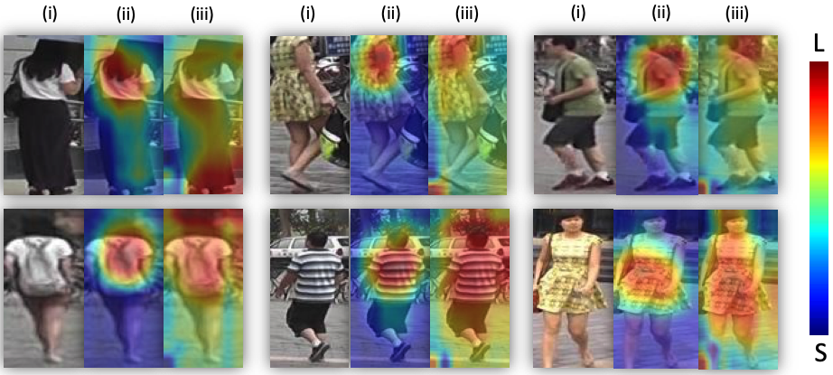
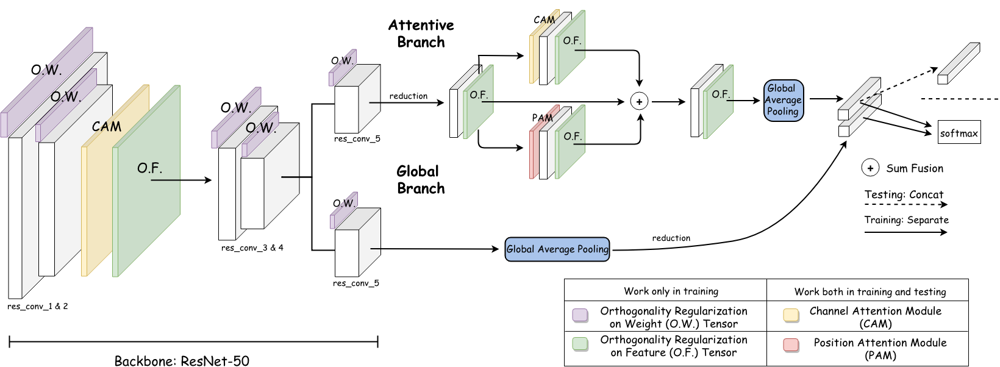
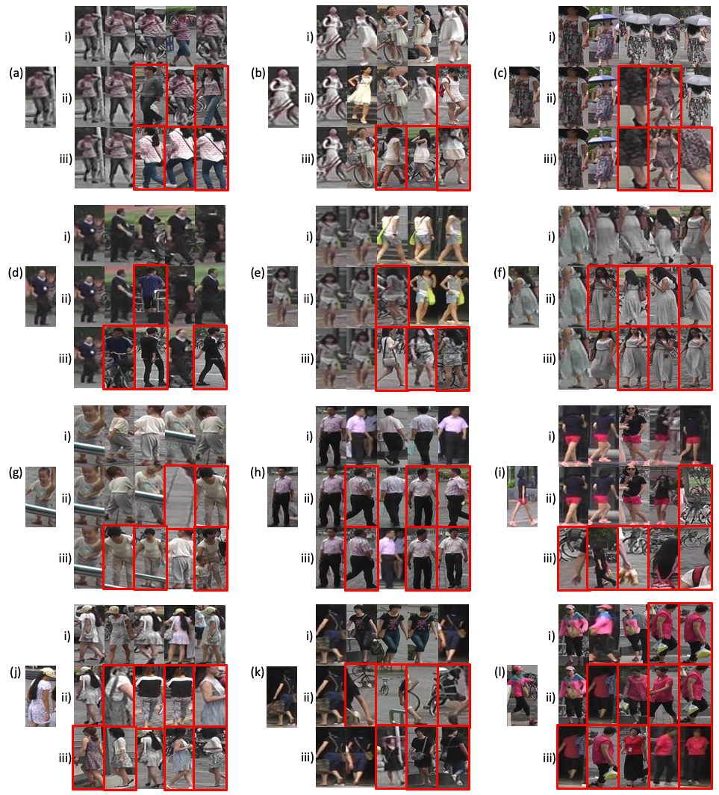

# ABD-Net: Attentive but Diverse Person Re-Identification

[](https://paperswithcode.com/sota/person-re-identification-on-msmt17?p=abd-net-attentive-but-diverse-person-re) [](https://paperswithcode.com/sota/person-re-identification-on-dukemtmc-reid?p=abd-net-attentive-but-diverse-person-re) [](https://paperswithcode.com/sota/person-re-identification-on-market-1501?p=abd-net-attentive-but-diverse-person-re)

Code for this paper [ABD-Net: Attentive but Diverse Person Re-Identification](https://arxiv.org/abs/1908.01114)

Tianlong Chen, Shaojin Ding\*, Jingyi Xie\*, Ye Yuan, Wuyang Chen, Yang Yang, Zhou Ren, Zhangyang Wang

In ICCV 2019

Refer to **Training Guides README** [here](./README_Training_and_Testing_Guides.md), original README [here](./README_ORIG.md), datasets README [here](./DATASETS.md), Model ZOO README [here](https://kaiyangzhou.github.io/deep-person-reid/MODEL_ZOO.html).

We provide complete usage pretrained models for our paper.

- Market1501 [best ABD-Net model](https://drive.google.com/file/d/13bvg8LUD7JinC-usAQyE2ys9zxo4P97e/view?usp=sharing)
- Duke [best ABD-Net model](https://drive.google.com/file/d/1ojw0wva6ZlcY0v4UjiwesCyiFonZgBz8/view?usp=sharing)
- MSMT17 [best ABD-Net model](https://drive.google.com/file/d/1_ZpSfOxrid9xpSecAxEA2WAa6h-uWc1O/view?usp=sharing)

More models will come soon. If you want a pretrained model for some specific datasets, please be free to post an issue in our repo.

## Overview

Attention mechanism has been shown to be effective for person re-identification (Re-ID). However, the learned attentive feature embeddings which are often not naturally diverse nor uncorrelated, will compromise the retrieval performance based on the Euclidean distance. We advocate that enforcing diversity could greatly complement the power of attention. To this end, we propose an Attentive but Diverse Network (ABD-Net), which seamlessly integrates attention modules and diversity regularization throughout the entire network, to learn features that are representative, robust, and more discriminative.

Here are the visualization of attention maps. (i) Original images; (ii) Attentive feature maps; (iii) Attentive but diverse feature maps. Diversity can be observed to make attention "broader" in general, and to correct some mistaken over-emphasis (such as clothes textures) by attention. (L: large values; S: small values.)




## Methods



We add a CAM (Channel Attention Module) and O.F. on the outputs of res\_conv\_2 block. The regularized feature map is used as the input of res\_conv\_3. Next, after the res\_conv\_4 block, the network splits into a **global branch** and an **attentive branch** in parallel. We apply O.W. on all conv layers in our ResNet-50 backbone, i.e.​, from res\_conv\_1 to res\_conv\_4 and the two res\_conv\_5 in both branches. The outputs of two branches are concatenated as the final feature embedding. 

Here are the detailed structures of CAM (Channel Attention Module) and PAM (Position Attention Module).


## Results

Our proposed ABD-Net achieves the state-of-the-art (SOTA) performance in Market-1501, DukeMTMC-Re-ID and MSMT17 datasets. The detailed comparison with previous SOTA can be found in [our paper](https://arxiv.org/abs/1908.01114).

|    Dataset     | Top-1 |  mAP  |
| :------------: | :---: | :---: |
|  Market-1501   | 95.60 | 88.28 |
| DukeMTMC-Re-ID | 89.00 | 78.59 |
|     MSMT17     | 82.30 | 60.80 |

Here are three Re-ID examples of ABD-Net (XE), Baseline + PAM + CAM and Baseline on Market-1s501. Left: query image. Right: i): top-5 results of ABD-Net (XE). ii): top-5 results of Baseline + PAM + CAM. iii): top-5 results of Baseline. Images in red boxes are negative results.




## Citation

If you use this code for your research, please cite our paper.

```
​```
@InProceedings{Chen_2019_ICCV,
author = {Tianlong Chen and Shaojin Ding and Jingyi Xie and Ye Yuan and Wuyang Chen and Yang Yang and Zhou Ren and Zhangyang Wang},
title = {ABD-Net: Attentive but Diverse Person Re-Identification},
booktitle = {The IEEE International Conference on Computer Vision (ICCV)},
month = {Oct},
year = {2019}
}
​```
```

